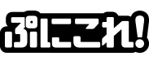

# Azumaker
Azumaker is a Japanese company selling anime merchandises.

[Company Website](https://www.azumaker.com/)

E-Commerce Website: [CharaON!](https://www.charaon.jp/)

## Product Line
### PuniColle! Series

PuniColle! (ぷにこれ！) series features design of anime characters drawn in a deformed style. Previously known as PetitColle (ぷちこれ), the merchandise from this series are usually acrylic keychains (with stand), but may be used on other merchandises such as acrylic diorama stands and mugs.

## Merchandise List
### Linens
| Type                  | Price (JPY) | Specifications                            |
|-----------------------|-----------------|-------------------------------------------|
| Big Towel (90cm)      | 3,500           | 900×600mm Material: Polyester, Nylon  |
| Big Towel (120cm)     | 4,200           | 1200×600mm Material: Polyester, Nylon |
| Blanket               | 5,000           | 1,000×700mm Material: Polyester       |
| Character Ooban Towel | 2,800           | 900×400mm Material: Polyester, Nylon  |
| Hyouri Cushion        | 2,700           | 300×200mm Material: Polyester, Cotton |

### Dishes
| Type    | Price (JPY) | Specifications                                                                   |
|---------|-----------------|----------------------------------------------------------------------------------|
| Mug     | 1,500           | Height: 95mm, Diameter: 82mm, Capacity: 350ml Material: Ceramic (Stoneware)  |
| Tea Cup | 1,500           | Height: 105mm, Diameter: 80mm, Capacity: 360ml Material: Ceramic (Stoneware) |

### Apparel
| Type                 | Price (JPY) | Specifications                                                                                                                                                                                                                                                                                                                                                                                                                                                                                                            |
|----------------------|-----------------|---------------------------------------------------------------------------------------------------------------------------------------------------------------------------------------------------------------------------------------------------------------------------------------------------------------------------------------------------------------------------------------------------------------------------------------------------------------------------------------------------------------------------|
| Full Graphic T-shirt | 6,000           | Material: Polyester 100% Usually comes with 3 sizes or just one size, and sizes may vary:  M: Length 67cm, Width 49cm, Shoulder Width 47cm, Sleeve Length 16cm L: Length 69cm, Width 53cm, Shoulder Width 50cm, Sleeve Length 18cm XL: Length 71cm, Width 57cm, Shoulder Width 53cm, Sleeve Length 20cm                                                                                                                                                                                               |
| Leather Case         | 1,500           | 90×90×20mm Material: Synthetic Leather Weight: 40g                                                                                                                                                                                                                                                                                                                                                                                                                                                                |
| T-shirt              | 3,200           | Material: Cotton Usually comes with 3 sizes, and may vary:  M: Length 68cm, Width 50cm, Shoulder Width 46cm, Sleeve Length 20cm L: Length 71cm, Width 53cm, Shoulder Width 49cm, Sleeve Length 21cm XL: Length 75cm, Width 56cm, Shoulder Width 52cm, Sleeve Length 22cm  M: Length 69m, Width 52cm, Shoulder Width 46cm, Sleeve Length 20cm L: Length 73cm, Width 55cm, Shoulder Width 50cm, Sleeve Length 22cm XL: Length 77cm, Width 58cm, Shoulder Width 54cm, Sleeve Length 24cm |
| Tote Bag             | 2,800           | Material: Cotton 100% Approximately 37cm long x 24cm wide x 12cm depth (three-dimensional), 37cm long x 35cm wide (flat). Handle Length: 55cm, Handle Height: 25cm Capacity: 10 L                                                                                                                                                                                                                                                                                                                             |

### Hanged Up
| Type                        | Price (JPY) | Specifications                                                                                                                  |
|-----------------------------|-----------------|---------------------------------------------------------------------------------------------------------------------------------|
| Acrylic Keychain            | 900             | Size varies, usually 90-100mm. Material: Acrylic                                                                            |
| Deka PuniColle! Keychain    | 2,000           | Bigger version of PuniColle! Keychain. Usually 150mm. Material: Acrylic.                                                    |                                                                                               |
| Pass Case                   | 1,200           | 94×70mm Material: Synthetic Leather                                                                                         |
| PuniColle! Keychain         | 900             | Usually 95mm, but can vary between 85-110mm. Material: Acrylic                                                              |
| PuniColle! Keychain w/Stand | 930             | Usually 95mm, but can vary between 85-110mm. Newer keychains (from 2019) comes with a stand. Material: Acrylic, PVC (stand) |

### On Walls
| Type                      | Price (JPY) | Specifications                                         |
|---------------------------|-----------------|--------------------------------------------------------|
| Hobo Toushin Dai Tapestry | 8,000           | 700×1550mm or 700×1600mm Material: Polyester Suede |
| Tapestry (B1)             | 6,000           | B1 (728×1030mm) Material: Polyester Suede          |
| Tapestry (B2)             | 3,000           | B2 (515×728mm) Material: Polyester Suede           |

### Stationeries
| Type                          | Price (JPY) | Specifications                                                                                                                                                                                                                            |
|-------------------------------|-----------------|-------------------------------------------------------------------------------------------------------------------------------------------------------------------------------------------------------------------------------------------|
| Character Rubber Mat          | 3,000           | 600×350×2mm Material: Polyester, PVC Rubber                                                                                                                                                                                           |
| Clear File                    | 400             | A4 (220×310mm) Material: PP                                                                                                                                                                                                           |
| Notebook Type Smartphone Case | 3,200           | W88×H159×D18mm Material: Synthetic Leather Compatible phones: <li>iPhone series</li><li>Xperia series</li><li>Galaxy series</li><li>Arrows series</li><li>AQUOS PHONE series</li>and other devices of size 150mm x 85mm (approx.) |

### Misc
| Type                           | Price (JPY) | Specifications                                                                                                                                                     |
|--------------------------------|-----------------|--------------------------------------------------------------------------------------------------------------------------------------------------------------------|
| Acrylic Bromide                | 1,200           | 118×74mm Material: Acrylic, PVC (stand)                                                                                                                        |
| Acrylic Chara Stand            | 1,700 or 2,000  | 94×150mm Material: Acrylic                                                                                                                                     |
| Acrylic Coaster                | 800             | 80mm Material: Acrylic                                                                                                                                         |
| Acrylic Diorama                | 1,500           | 100×118mm Material: Acrylic                                                                                                                                    |
| Acrylic Diorama                | 2,000           | 118×150mm Material: Acrylic                                                                                                                                    |
| Acrylic Diorama                | 4,000           | 240×150mm Material: Acrylic                                                                                                                                    |
| Acrylic Portrait               | 1,700           | 94×150mm Material: Acrylic                                                                                                                                     |
| Badge                          | 600             | Diameter: 75mm Material: Steel, PET                                                                                                                            |
| Deka PuniColle! Acrylic Figure | 2,000           | 150mm Material: Acrylic, PVC (stand)                                                                                                                           |
| Mobile Battery                 | 4,200           | H111×W65×D9mm Weight: 103g Capacity: 4000mAh Input (microUSB): 5V Maximum Output: 5V 1000mA Comes with MicroUSB cable Battery: Lithium ion |                                                                                                                                                                                                     |
| Wooden Stand                   | 2,000           | 140×106mm Material: Wood                                                                                                                                       |
